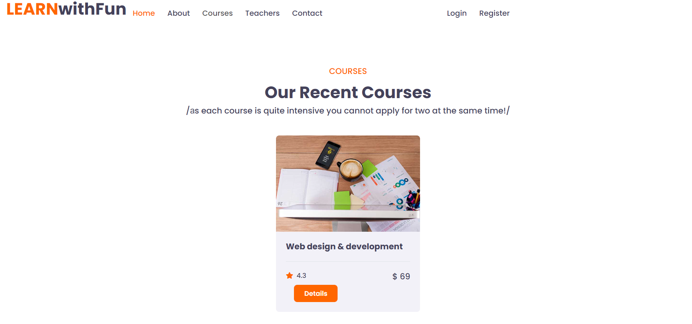

<h1 align="center"><i>Learn With Fun</i></h1>

**_
Learn With Fun is a new generation online training platform. You can now learn the latest technology from anywhere in the world. You will be taught by top experts with many years of experience.
The training is completely innovative, with many practical tasks and is directed and adapted entirely to the labor market.
_**

    

    
    

    
    

    
    

    
    

    

<h2 align="center">For server side is used SoftUni Practice Server with some corrections</h2>
<h3 align="center">To start: run node server.js</h3>

<h2 align="center">For client side is used template from HTML Codex, but some of the pages are custom created</h2>
<h3 align="center">To start: run npm start</h3>
