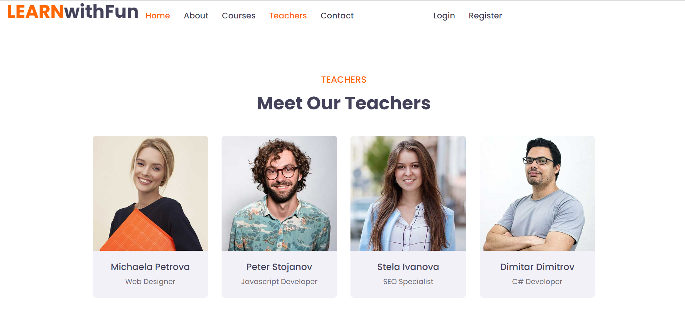

<h1 align="center"><i>Learn With Fun</i></h1>

**_
Learn With Fun is a new generation online training platform. You can now learn the latest technology from anywhere in the world. You will be taught by top experts with many years of experience.
The training is completely innovative, with many practical tasks and is directed and adapted entirely to the labor market.
_**

    

    
    

    
    

    
    

    
    

    

   <h2 align="center">The repo includes the "<i>back-end</i>" and the "<i>front-end</i>" of the app.</h2>

<h3>For server side is used SoftUni Practice Server with some corrections.</h3>
<h4>To start: run node server.js</h4>

<h3>For client side is used template from HTML Codex, but some of the pages and elements are custom created.</h3>
<h4>To start: run npm start</h4>

Used features of the platform:

- <i><b>Responsive Design</b></i>
- <i><b>Home page with carousel and top courses</b></i>
- <i><b>Authentication (Register, Login)</b></i>
- <i><b>Add questions</b></i>
- <i><b>Details for all courses</b></i>
- <i><b>Apply for chosen course(register users only)</b></i>
- <i><b>Add homework(register users only)</b></i>
- <i><b>Update homework (owner only)</b></i>
- <i><b>Delete homework (owner only)</b></i>
- <i><b>Like homework(register user, but not owner)</b></i>
- <i><b>Unlike homework(register user, but not owner)</b></i>

Dependencies, (besides Create-React-App deps): 

- React Router v6
- uniqid
- react-bootstrap

